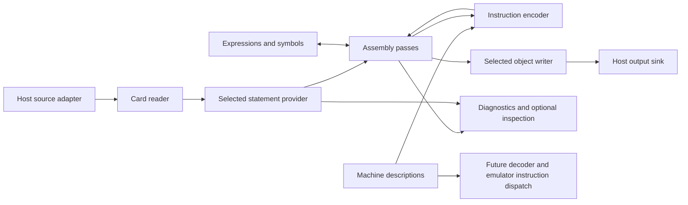

# Mainframe Classic Assembler: approved architecture

30 September 2026. **Approved for local implementation.** The user agreed the principles and interfaces and authorised parallel implementation with unit tests and QA. The current architecture and source headers describe the implemented subset. Native hosting and complete runtime/OS assembly remain separate qualification steps.

I want `mf-classic-as` to assemble the native sources needed by newlib, PDPCLIB
and PDOS on the host, removing their dependency on a z/OS assembly step. I also
want the same product to run inside z/PDOS and on small bootstrap hosts. A later
build can add richer traditional macro support, cREXX macros and other features
without making them dependencies of the bootstrap build.

The product home is [adesutherland/z-pdos](https://github.com/adesutherland/z-pdos),
alongside Mainframe Classic C and the OS. Mainframe Lab retains licensed upstream
tools, private native-reference outputs and historical research as references.
as370 is no longer the implementation seed. The existing original fixture
sources and independently calculated expectations remain useful qualification
material. Nothing here relabels inherited code or establishes a formal
clean-room process.

The [interface proposal](APPROVED-CONTRACTS.md) defines the contracts below.
The [first-increment plan](../BACKLOG.md) defines the seed and acceptance
sequence. [Product names](../development/PRODUCT-NAMES.md) owns the family and command names.

## Approved principles

1. **A small portable core.** Use the C89/C90 common language subset. The core
   requires eight-bit bytes and an unsigned integer type capable of at least
   32 bits, but does not assume host word size, byte order or character encoding.
   C99, C++, POSIX, threads and a cREXX runtime are not core prerequisites.
2. **One product with optional components.** Bootstrap, standard and extended
   are build capability sets of `mf-classic-as`, not incompatible language
   forks or new product names. Richer builds preserve the declared bootstrap
   subset and its object semantics.
3. **Explicit interfaces, bound at build time.** Small ordinary C functions and
   callback tables let implementations supply streams, storage, preprocessing,
   diagnostics and object output. No dynamic plugin loader is required.
4. **Bounded resources with visible failures.** Each session has caller-chosen
   limits and no hidden global workspace. Exhaustion, unsupported syntax,
   ambiguous addresses and out-of-range fields are diagnosed. No silent
   truncation, guessed instruction or successful incomplete output is allowed.
5. **Separate contracts.** Machine features, address mode, assembler language,
   object representation and host services are distinct selections. A 64-bit
   target does not require a 64-bit host, and an old object writer does not
   acquire wider relocation support merely because the encoder handles LG.
6. **Share machine facts, keep execution separate.** Independently authored
   machine descriptions and encoding utilities can serve a future decoder,
   disassembler and CPU emulator. CPU execution, memory services, interrupts,
   devices and OS policy are outside the assembler.
7. **Original implementation and traceable sources.** New project material is
   licensed under MIT. Review each inherited file
   under its actual terms. Cite manual editions and sections for architecture
   data; do not import upstream opcode headers, IBM macro libraries or private
   expansions into the new implementation.
8. **Evidence independent of shared code.** Fixed expected instruction bytes
   and object semantics remain independent controls. Agreement between our
   encoder and our decoder alone cannot qualify either one.
9. **UTF-8 for text, explicit octets for binary data.** Internal source text,
   names and diagnostic text use UTF-8. The bootstrap language may accept only
   its ASCII subset. Target character constants, instructions, object records
   and machine memory remain explicit byte representations; text conversion
   never changes those bytes implicitly.

## Builds and growth

| Capability set | Intended contents | Qualification boundary |
| --- | --- | --- |
| Bootstrap | Fixed-card reader, bounded expressions/symbols/sections, selected instruction formats and directives, identity preprocessing, classic object writer, simple diagnostics and a small host adapter | The documented subset and selected bootstrap source consumers only; no macro-language completeness claim |
| Standard | The same core with the traditional macro subset, resolver, literals/addressability and source features required by the runtime/OS inventory | Exact newlib, PDPCLIB and PDOS assembly inputs, including their reviewed macro dependencies |
| Extended | Additional machine/language/object profiles, richer inspection and optional cREXX macro backends | Each new capability has its own source consumers and independent checks |

These are intended capability sets, not three delivered assemblers. The initial
bootstrap subset must be chosen from real consumer source, including compiler
output when rebuilding tools. It need not process every unmodified runtime or
OS source file. Any simplification used for a bootstrap source variant must be
explicit, preserved with that component and checked against its maintained
source. A build requiring a simplified variant must identify it rather than
claim to rebuild the unmodified source.

No separate bootstrap binary name is required: product/version information
identifies the build's capabilities. Optional modules should be separate C
translation units so an ordinary linker can omit them without special link-time
optimisation. Dependencies flow from richer components towards the common core.
The bootstrap build never references an unavailable richer component.

## Logical components

| Component | Responsibility | Must not own |
| --- | --- | --- |
| Machine descriptions | Instruction identities, format fields, operand restrictions, aliases and feature availability, with source citations | Macro syntax, OS calling conventions or CPU execution functions |
| Value and encoding utilities | Checked bit/byte operations, wide values, sign interpretation and target byte order | Native memory casts or reliance on signed C overflow |
| Source reader | Fixed-card fields, continuations, comments and source locations; optional additional readers later | Filesystem naming policy or macro interpretation |
| Statement provider | Supply a replayable stream after the selected preprocessing backend | Instruction encoding or object serialization |
| Expression and symbol engine | Values, relocation expressions, definitions, references and internal names | Object-format name truncation or host-size address arithmetic |
| Assembly engine | Passes, sections, layout, directives, literals, USING/addressability and origin tracking | File paths, subprocesses or output transport |
| Instruction encoder | Validate typed operands against the selected machine description and return bytes | Symbol-table mutation or choosing a machine implicitly |
| Object writer | Serialize checked sections, symbols, bytes, gaps, fixups, mode metadata and entry information | Inventing missing relocations, rewriting instructions or linking modules |
| Diagnostics and inspection | Structured errors, source/macro locations and optional listing/export observers | Successful output policy or language semantics |
| Host driver/adapters | Arguments, files, records, character conversion, storage, final output handling and host return codes | Hidden assembler language changes |
| Optional macro backends | Identity pass-through, traditional macros, or later cREXX expansion through the statement-provider contract | Mandatory runtime dependencies for the bootstrap build |

The first implementation can put related helpers together in a small number of
files. Logical responsibilities and dependency direction matter more than one
file per box. Separate modules when an optional capability or interchangeable
implementation actually needs the boundary. Avoid a universal framework or a
per-instruction plugin mechanism.

## Data flow

The assembly session validates layout and retains the symbol/section information
needed for emission. Its statement provider supplies the same expanded program
for each pass. A small build can reread source; a richer backend can use a spool
or memory. Neither approach implies that the complete source and output must
fit in RAM. Macro expansion happens once logically; stateful expansion is not
silently rerun with different clocks, environment or external input.

Encoding consumes resolved operands. Classic object emission preserves gaps,
section ownership and fixups rather than assuming one flat image. Output is
usable only after successful final validation and sink completion. A minimal
host may mark a failed stream unusable; atomic filesystem rename is an optional
driver facility, not a core requirement.

## Host and portability contract

The portable core takes explicit callbacks and session storage. It does not
open files, discover its executable path, inspect environment variables, launch
processes, read the clock or terminate the process. It needs no locale, terminal,
network, filesystem hierarchy, memory mapping, operating-system seek or writable
temporary directory. A callback implementation may use these facilities where
available without changing the core contract.

Mandatory services are a replayable statement source, suitably aligned bounded
storage, a sequential output sink and a structured diagnostic receiver. Replay
can mean reopening a source, resetting a record device or reading a supplied
spool. COPY/include resolution is an optional capability and fails explicitly
when requested without a resolver.

Wide values use portable parts or byte representations; native 64-bit arithmetic
is an optional implementation. Target ranges are checked before narrowing.
Internal labels remain length-bearing names. External name limits belong to the
selected object writer and must produce errors rather than truncation.

Internal textual spans use UTF-8 and explicit byte lengths. Input and host
adapters convert EBCDIC or other supported external text encodings at the
boundary. Implementations must not accidentally compare UTF-8 bytes with the
host C execution character set. Source-table mnemonics, parser character codes
and any core textual constants must be represented accordingly even when built
with an EBCDIC C compiler. Conversion failures are diagnosed, not dropped.

The bootstrap language can reject non-ASCII source characters explicitly while
still satisfying the UTF-8 internal-text rule: ASCII text is valid UTF-8 under
[RFC 3629](https://www.rfc-editor.org/rfc/rfc3629.html). It needs no Unicode normalisation,
case folding, collation, locale or general Unicode library. Richer builds can
add defined identifier/literal support later. UTF-8 encoding alone does not
promise that every Unicode name is legal in every object format.

Card boundaries and original source columns must be preserved before conversion
changes byte lengths. Diagnostics carry original coordinates; UTF-8 byte offsets
are not silently treated as card columns. A UTF-8 fixed-card source convention
must define its columns before non-ASCII support is claimed. Character literals
are encoded separately for the target and sized in target bytes, not UTF-8 bytes.
External symbol names are likewise checked after the selected object encoding.
File names remain host-owned; textual names exchanged at interfaces use UTF-8
and the adapter maps them to the native filesystem or record environment.

The first host driver can use standard C stdio and allocation, while the core
can also work with fixed arenas and caller-provided record I/O. Neither a tiny
host nor its allocator is assumed to offer an unlimited heap. Wider application
hosts may choose generous capacities; 24-bit constraints remain a separate
measured host profile, not defaults imposed on 31-bit or 64-bit work.

## Macro boundary

The bootstrap provider passes ordinary statements through and rejects unsupported
macro/conditional-assembly constructs explicitly. The standard provider adds
only the documented traditional subset needed by consumers. Service and layout
macros remain owned by the OS/runtime sources that use them.

The first preprocessing contract must not pretend that every HLASM macro can be
flattened independently of assembly state. Attributes or conditional behaviour
that require symbol/layout information are either supported by an explicitly
defined query/phase contract or rejected in that language profile. Such an
extension needs a versioned interface and tests before adoption.

A future cREXX provider emits the same statement stream and provenance. An
external cREXX preprocessing step can supply an ordinary source/spool file; an
embedded backend can be added on capable hosts later. Both remain optional.
Expanded statements pass through the same validation, encoder and object writer.

## Machine and emulator boundary

Machine descriptions contain independently authored factual encodings and
profile membership. Start with ordinary original C tables; a generator or schema
is justified only by an actual second consumer. Do not introduce a runtime JSON
parser or generation step as a bootstrap prerequisite. Committed/generated C,
if later used, must remain buildable with the baseline compiler.

An emulator may reuse instruction identities, decoded fields, profile checks
and basic value utilities. It must supply its own execution state and semantics,
with independent condition-code, fault and interrupt checks. ISA coverage,
addressing width and operating-system compatibility are separate claims.
Historical S/360, S/370, later real IBM machines, community S/380 and fictional
profiles stay explicitly distinct. Counterfactual opcodes/ABIs are not selected
by this design.

## Source and rights boundary

Use [edition-specific architecture and language references](../../../machines/UPSTREAM.md) as factual sources. Public access does not grant blanket public-domain status. Do not bundle manuals, copied tables, private macro libraries or expansions. Inherited tools and native reference evidence remain outside this product tree.

The MIT grant covers original project material only. Future GCC, runtime and OS imports retain their own terms; [the component map](../../../LICENSES.md) records them. The implementation is independently authored; no formal clean-room claim is made.
