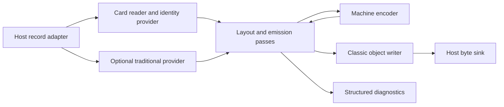

# Mainframe Classic Assembler architecture

`mf-classic-as` turns a declared source language and machine profile into native
classic object records. We keep the small bootstrap core independent of its
host so the same assembly code can later run on z/PDOS or a simple record-based
system. The initial implementation uses the C89/C90 common subset.

## Components and responsibilities

| Module | Responsibility | Inputs and outputs |
| --- | --- | --- |
| `reader.c` | Decode raw ASCII or CP037 records, preserve card columns, recognize fields, provide identity preprocessing | Record callbacks to replayable statement callbacks |
| `macro_cards.c`, `macro_provider.c` | Optional original fixed-card scanner and bounded traditional substitution provider | Raw records to the same replayable statements; separate library, explicit selection |
| `values.c` | Checked two-part wide values and explicit ASCII/CP037 conversion | Numeric text and octets; no host locale |
| `machine.c` | Original instruction descriptions and pure checked encoding | Profile, mnemonic and typed fields to instruction bytes |
| `assemble.c` | Two passes, expressions, symbols, sections, layout, branch aliases, bounded literal pools and addressability | Statement stream to checked writer events and diagnostics |
| `object.c` | Classic ESD/TXT/RLD/END serialization and format limits | Final sections/symbols, bytes, gaps, fixups and entry to byte sink |
| `main.c` | Desktop arguments, source files, bounded storage, diagnostics and output ownership | Standard C host adapter; the core exposes no `FILE` or paths |

Public source-level interfaces live in [mf_classic.h](../include/mf_classic.h).
Providers and writers are ordinary function tables selected at build time.
There is no dynamic plugin framework. Related expression/symbol/layout helpers
share the engine translation unit until a real replacement or optional module
justifies splitting them.

## Assembly and ownership

The first pass builds bounded symbol and section information. The source is
replayed for validated emission. Replay fingerprints, counts and layout checks
detect inconsistent input; this is a consistency check, not an adversarial
cryptographic guarantee. The provider owns stable replay. The engine does not
retain a copy of every statement or complete output image.
Literal identities retain only selected unique spellings and final section/
offset assignments. LTORG chooses the current real section; the implicit END
pool chooses the first real section. Pool collection crosses section borders.
Alias masks and pool placement remain source-language responsibilities; the
machine encoder receives only resolved architectural fields.

The driver owns storage, source/provider and sink/writer lifetimes. Each
assembly has its own context. Borrowed statement fields last until the provider
advances; retained names are copied to session storage. Components never reset
the caller's arena or close a caller's device. Destroy contexts and close
providers before releasing all session allocations.

A failed source, range, capacity, replay, writer or sink operation makes output
invalid. An END record can only be attempted after valid assembly events, and
consumers may use a deck only after successful writer and sink completion.
The desktop adapter removes failed output; a record-only host can mark an
incomplete stream unusable without needing filesystem rename.

## Portability and profiles

The core requires eight-bit `unsigned char` and an unsigned integer type of at
least 32 bits. It masks 32-bit parts explicitly and represents wide constants
with two parts. It needs no `long long`, `<stdint.h>`, threads, POSIX, locale,
cREXX runtime or heap implementation. Callers provide aligned bounded storage,
replayable input and sequential output.

Internal text is UTF-8; the initial language accepts ASCII syntax. Core parser
codes and mnemonic data use numeric ASCII independently of the C execution
character set. Card columns are preserved before decoding. Character constants
and external names use declared CP037 encoding; instructions and object records
remain binary octets. UTF-8 byte length is never substituted for target literal
length or a future non-ASCII card-column convention.

Machine features, address/residence metadata, language capabilities, object
widths and host limits are separate. Absolute eight-byte AD constants do not
imply eight-byte external relocations. The classic writer limits external
names to eight encoded bytes and rejects unrepresentable names; the engine can
retain longer internal names.

## Growth

Bootstrap, standard and extended are intended capability sets of one product.
The bootstrap core and first optional traditional provider are implemented.
The provider acquires fixed definition/frame/argument workspaces at creation,
then streams expansions without retaining an expanded compilation unit or call
history. It fingerprints every raw record on replay, including comments and
unused definitions. Synchronous observers expose borrowed nesting coordinates;
delayed engine diagnostics retain only the outermost invocation. See
[the macro contract and subsequent gates](MACROS.md).
Service/layout definitions belong
to their runtime or OS component and are independently written or imported with
confirmed rights. Assembly-state macro queries require an explicit phase/query
contract. An optional later cREXX provider uses that contract; neither backend
becomes a bootstrap dependency.

The original machine descriptions and value helpers can serve a future decoder
or emulator. CPU execution, memory, interrupts, devices and OS policy remain
separate. Do not infer a new ISA, ABI or complete HLASM implementation from this
seed. See [next consumer work](CONSUMERS.md) and [reference sources](../../../architecture/SOURCES.md).
